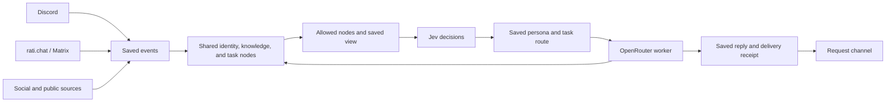

# Shared awareness and task model routing

Research date: 8 October 2026, America/Vancouver.
Status: proposed design. Source observations and live checks appear below.
The implementation steps describe the next changes.

RatiChat should have one persistent identity, knowledge store, and task history.
Discord, rati.chat, Matrix, and social adapters should read the same allowed
nodes. Each conversation should keep its own expanded, collapsed, and pinned
view. Topic and persona choices should control the model for a task.

## Current source

The RatiChat baseline is `1ab06a5b7edf08e8a19ea5668b162b10570cab80`.
CosyWorld's live main was checked with `git ls-remote` and is
`54a21ee720ff6d301dcf0679808055ce2c22fe77`.

| Finding | RatiChat source |
| --- | --- |
| Matrix and Discord share one world state and AI engine in the bot worker. | [MainOrchestrator](../chatbot/core/orchestration/main_orchestrator.py), line 376 |
| rati.chat uses Element Web over the Matrix homeserver. The client and bot have separate Fly apps. | [Element config](../deploy/matrix/element-web/config.json), [deployment guide](../deploy/matrix/README.md) |
| The active request catalog contains the current channel and its source nodes. | [PayloadBuilder](../chatbot/core/world_state/payload_builder.py), line 332 |
| Each request clears node metadata before opening its channel and saved channel memory. | [NodeProcessor](../chatbot/core/node_system/processor.py), line 245 |
| Saved memory and source caches use platform and channel keys. The memory node includes up to five settled turns within 6,000 characters. | [ResearchStore](../chatbot/core/node_system/research_store.py), lines 346 and 382 |
| World state starts empty. User memories, knowledge, and development tasks also have in-memory maps. | [WorldStateManager](../chatbot/core/world_state/manager.py), [structures](../chatbot/core/world_state/structures.py) |
| Planning, final replies, and proactive writing use one configured model. | [AIDecisionEngine](../chatbot/core/ai_engine.py), lines 47, 601, 780, and 807 |
| Proactive writing receives a public source node through its own composition path. | [ProactiveSourceService](../chatbot/core/node_system/proactive_sources.py), line 355 |

The existing saved request queue, source watches, and send receipts provide a
useful foundation. A shared store should connect that recovery path to lasting
facts, people, topics, and tasks. The web deployment findings come from source
inspection.

## One store, several views

Persist these records:

| Record | Contents |
| --- | --- |
| Events | Stable ID, source platform, channel, sender, timestamp, type, content, audience, and receipt |
| People | Stable internal actor ID, verified platform account links, preferences, and evidence |
| Nodes | Stable ID, kind, content, summary, content version, summary version, audience, evidence references, and update time |
| Views | View ID, current conversation, expanded nodes, collapsed nodes, pins, and context budget |
| Tasks | Topic, goal, persona, inputs, node versions, selected route, progress, result, and delivery destinations |
| Routes and attempts | Catalog version, chosen model, API path, supported settings, decision answers, provider, actual serving model, usage, latency, and cost |

Use a stable node ID such as `topics.cpython` or `tasks.<id>`. A Discord view and
a Matrix view can expand those same IDs. Each view also opens its current
conversation. Save view changes under the view ID so simultaneous requests
keep independent attention choices.

At ingestion, save the event and update its node projection in one transaction.
At boot, load the latest projection and continue from the saved event position.
Generate a summary for a specific content version. Publish it while that version
is current. Collapsed nodes retain their summary and evidence links.

Keep source, audience, and reader permissions on every node. Build the allowed
catalog for the current actor and destination before choosing expansions.
Community facts and shared tasks can appear across linked community channels.
Personal facts follow the verified actor and their audience. Each platform
account links to that actor through an account proof.

Start with SQLite on the current single bot volume. Put storage behind one
`AwarenessStore` interface. Several independent workers should use a common
network database through that interface.

## Jev decision path

Use `POST https://openrouter.ai/api/alpha/decisions` with
`model: "typesafe/jev-1.13"`. Supply a compact `state` and typed `questions`.
Choice questions give valid option IDs in `criteria`. Responses include
choices or scores, probabilities, provider, serving model, and usage.
See the [Decisions API contract](https://openrouter.ai/docs/api/api-reference/alphadecisions/submit-a-decisions-request).

CosyWorld has the matching client in
[ai_decisions.rs](https://github.com/cenetex/cosyworld/blob/54a21ee720ff6d301dcf0679808055ce2c22fe77/v2/orchestrator-rust/src/ai_decisions.rs#L191).
It uses compact state, a four-second timeout, response limits, and checks on
choices and probabilities. Its current uses include speaking and repeated idea
decisions. Choice support is implemented and tested. See
[decision-models.md](https://github.com/cenetex/cosyworld/blob/54a21ee720ff6d301dcf0679808055ce2c22fe77/v2/docs/decision-models.md#L38).

For RatiChat, ask in stages:

1. Choose the task, topic, persona, and relevant nodes from the allowed catalog.
   Use one relevance question per candidate or a bounded sequence of choice
   questions for expansions.
2. Expand those nodes. Build worker candidates for the task's capabilities,
   context size, deadline, persona preferences, and remaining budget.
3. Ask Jev for the worker model and supported effort. Save the route and input
   node versions before calling the worker.
4. Run the saved route. Save its result as shared nodes and update the task.
5. Choose whether a completed result merits a reply or proactive post. Compose
   it from the shared nodes and persona, then use the saved delivery path.

Keep the initial decision state within CosyWorld's 24 KiB limit. Select returned
catalog IDs. Check probabilities and answer types. Use a saved fast fallback
route when a decision call times out. Continue the saved task and attempt after
a restart.

## Dynamic access to OpenRouter models

Expose the current OpenRouter catalog as expandable model nodes. Give the
planner a catalog reader with filters for capability, cost, context, and
provider. Give it a task model assignment action. The server should translate
eligible entries into Jev choice IDs and check the returned choice. This gives
the decision path access to the catalog while keeping each task's route,
budget, and settings clear.

Refresh catalog metadata with a saved snapshot version. Store observed latency
and recent service failures beside public capabilities and rates. Each task
can choose a model for its topic, role, or swarm persona. Child tasks share the
parent task's remaining budget and awareness nodes.

| Starting route | Use in this design | Listed input / output per 1M tokens |
| --- | --- | --- |
| `typesafe/jev-1.13` | Small typed decisions | $0.042 / $0 |
| `anthropic/claude-haiku-5.5` | Fast summaries, replies, and routine workers | $0.10 / $0.50 |
| `openai/gpt-6-luna` | Fast extraction, task plans, and drafts | $0.10 / $0.50 |
| `openai/gpt-6.1-sol` | Complex planning, research, and review | $2 / $10 |

These are current catalog rates for ordinary context sizes. Larger prompts and
service tiers can change the rate. Sources:
[Jev](https://openrouter.ai/typesafe/jev-1.13),
[Haiku 5.5](https://openrouter.ai/anthropic/claude-haiku-5.5/),
[Luna](https://openrouter.ai/openai/gpt-6-luna), and
[Sol](https://openrouter.ai/openai/gpt-6.1-sol).
The roles are the proposed starting policy. Task examples and measured results
should guide later routing.

Build requests from each route's supported parameters and API path. Record
native tool calls and JSON action plans as separate capabilities. Official
OpenAI documentation specifies Responses for Sol tool calls and Chat
Completions function calling with `reasoning_effort=none` for Luna. See
[Luna](https://developers.openai.com/api/docs/models/gpt-6-luna) and
[Sol](https://developers.openai.com/api/docs/models/gpt-6.1-sol).
RatiChat's current JSON action-plan protocol is a useful transport option.
Confirm the OpenRouter provider path for each transport during integration.

Use a direct Jev choice for a saved task route. The optional
[Jev Router](https://openrouter.ai/docs/guides/routing/routers/jev-router)
selects a model and effort for an individual request. Its cost tiers and model
lists express preferences. An exact route chosen from checked candidates
supports firm task budgets and persona bindings.

## Persona and swarm continuity

Persist `persona_id`, voice instructions, model preference or exact binding,
and binding version. A persona keeps those records across every channel.
Task planning and worker models can vary while identity and shared awareness
remain stable.

CosyWorld gives exact actor bindings priority. Its keyed pools make a stable
choice for the same world, actor, salt, and catalog snapshot. Useful examples are
[content_load.rs](https://github.com/cenetex/cosyworld/blob/54a21ee720ff6d301dcf0679808055ce2c22fe77/v2/orchestrator-rust/src/content_load.rs#L790),
[voice_pool.rs](https://github.com/cenetex/cosyworld/blob/54a21ee720ff6d301dcf0679808055ce2c22fe77/v2/orchestrator-rust/src/voice_pool.rs#L83), and
[ai_gateway.rs](https://github.com/cenetex/cosyworld/blob/54a21ee720ff6d301dcf0679808055ce2c22fe77/v2/orchestrator-rust/src/ai_gateway.rs#L470).
Save the persona binding and its version with each RatiChat task.

A swarm task should have one coordinator and bounded child tasks. Each child
gets its persona, saved route, allowed node view, tool scope, and budget.
Child results enter the shared store. The coordinator reads those result nodes
and writes one accepted result. Each requested destination has its own delivery
receipt. A channel change refers to the same task ID.

## Live Jev probe

A small request used RatiChat's linked OpenRouter account on 8 October 2026.
It described a synthetic task to summarise two available public technology
headlines. It offered Haiku, Luna, and Sol as choices.

- HTTP status: 200.
- Measured request time: 626 ms for this one probe.
- Serving model: `typesafe/jev-1.13-20260917`; provider: TypeSafe.
- Selected worker: `anthropic/claude-haiku-5.5`.
- Probabilities: Haiku 0.63, Luna 0.37, Sol 0.
- Confidence: 0.45; additional research score: 0.09.
- Usage: 669 input tokens, 62 output tokens, $0.000028098.
- Choice, probability bounds, probability sum, and score passed checks.

This confirms the linked account's decision path and response shape. It is one
synthetic connection check. Worker quality and latency need task examples.
Calibrate thresholds on those examples. Two suitable fast models can receive
similar scores. Escalation should follow the task's needs, answer checks, and
remaining budget.

## Implementation order and checks

1. **Shared store and catalog.** Add events, durable nodes, identity links,
   versioned summaries, and saved views. Connect intake and confirmed outcomes
   to the store. Let every platform expand the same allowed nodes. Check a
   Discord project discussion, a restart, and a follow-up through rati.chat.
2. **Jev and task routing.** Add a compact decision client, catalog snapshots,
   saved task routes, model-aware request builders, and route recovery. Check
   valid choices, timeout fallback, cost accounting, and workers with the
   linked account.
3. **Shared tasks and personas.** Add persisted tasks, bounded child tasks,
   persona bindings, and proactive task views. Check cross-channel task
   continuation, concurrent views, worker retries, and one accepted result.

Retain current request and delivery receipts through migration. Preserve
channel authority for actions. Charge retries and child tasks to the saved
task budget. Accept result updates against their input node versions so newer
facts receive a clear follow-up attempt.

The central acceptance case is: start research in Discord, restart the bot,
continue the task through rati.chat, and receive a result based on the same
project, people, persona, and task nodes. Each conversation keeps its expanded
view and reply destination.

